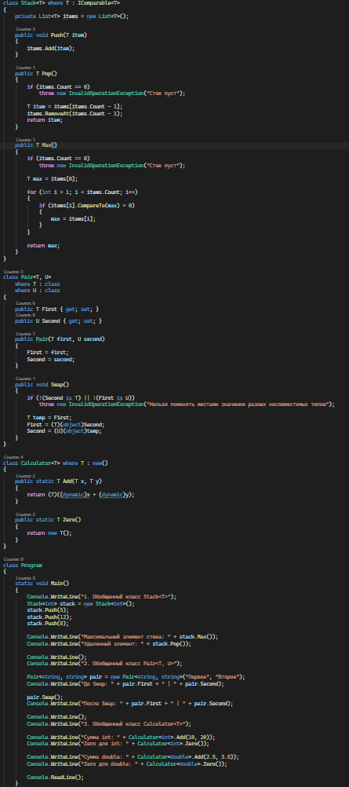
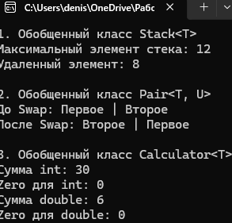

# C# KT9

1. Напишите обобщенный класс Stack<T>, который реализует структуру данных стек для хранения элементов типа T. Затем напишите ограничение для этого класса, чтобы он мог работать только с типами, которые реализуют интерфейс IComparable<T>. Затем напишите метод T Max(), который возвращает максимальный элемент стека с помощью интерфейса IComparable<T>.

2. Напишите обобщенный класс Pair<T, U>, который хранит пару значений типов T и U. Затем напишите ограничение для этого класса, чтобы он мог работать только с типами, которые являются ссылочными типами (class). Затем напишите метод void Swap(), который меняет местами значения пары.

3. Напишите обобщенный класс Calculator<T>, который имеет статический метод T Add(T x, T y), который возвращает сумму двух значений типа T. Затем напишите ограничение для этого класса, чтобы он мог работать только с типами, которые имеют parameterless конструктор (new()). Затем напишите метод T Zero(), который возвращает нулевое значение типа T с помощью parameterless конструктора.

### Код

### Результат

